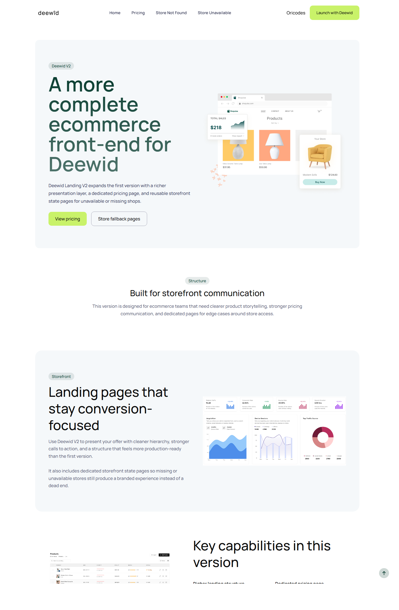
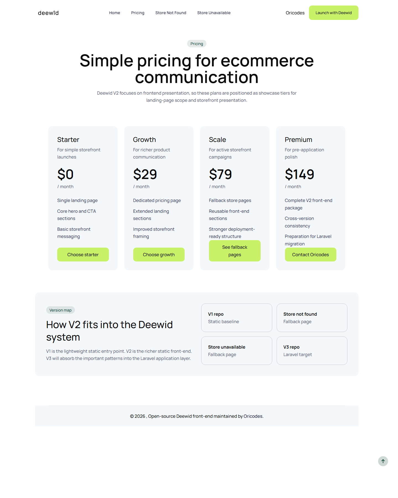

# Deewid Landing V2

Deuxieme version publique de Deewid, une version front statique plus complete basee sur Gulp, Tailwind CSS et un systeme de partials HTML.

Cette V2 inclut une landing enrichie, une page pricing dediee, et deux pages d'etat de boutique:

- `store-not-exist`
- `store-unavailable`





## Apercu

- Landing page e-commerce statique
- Page pricing
- Pages d'etat de boutique
- Pipeline Gulp pour generer le site final
- Compatible GitHub Pages via build statique

## Stack

- HTML avec partials
- Tailwind CSS
- Gulp
- JavaScript

## Developpement

```bash
npm install
npx gulp
```

## Build

```bash
npx gulp build
```

Le build final est genere dans `dist/`.

## Versions Deewid

- `deewid-landing-v1`
  - Repo : `https://github.com/adrielzimbril/deewid-landing-v1`
  - Preview : `https://adrielzimbril.github.io/deewid-landing-v1/`
- `deewid-landing-v2`
  - Repo : `https://github.com/adrielzimbril/deewid-landing-v2`
  - Preview : `https://adrielzimbril.github.io/deewid-landing-v2/`
- `deewid-landing-v3-laravel`
  - Repo : `https://github.com/adrielzimbril/deewid-landing-v3-laravel`
  - Live app : `https://deewid-landing-v3.adrielzimbril.com/`

## Maintien

Projet maintenu par Oricodes.

- Site : `https://www.oricodes.com/`
- GitHub : `https://github.com/adrielzimbril`

## Licence

MIT. Voir `LICENSE`.


